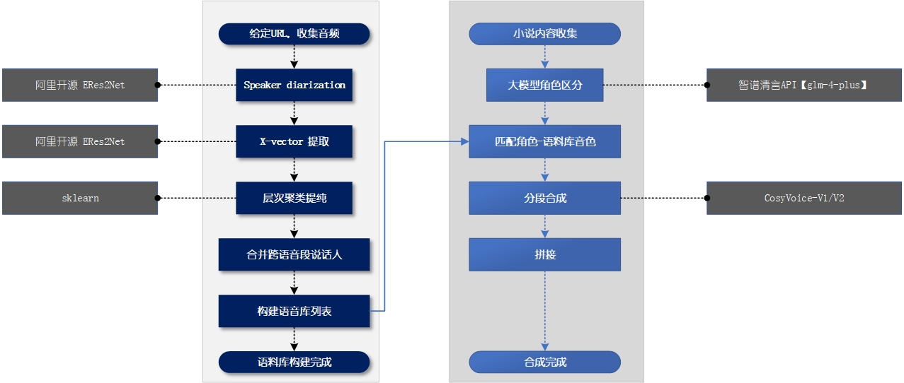

# Multi-Character-StoryTeller

示例音频，小说斗破苍穹片段：
<audio controls>
  <source src="斗破苍穹-5-Part.wav" type="audio/mpeg">
</audio>

多角色小说合成，整体流程图如下，可从网络获取喜欢音色，并自定义至指定小说角色。



## 语音库建立

1. 从网络搜索目标音色，单人、多人均可，给定URL下载音频
2. 使用说话人分离模型进行角色分离，阿里开源支持2-10人
3. 分离自聚类结果清洗，提取声纹，使用层次聚类去除分离结果中可能存在的错误
4. 多段长音频间可能存在相同说话人，尤其是下载同一本有声书音频时，必然存在。因此，添加跨长音频间的说话人聚类。对应 Lib_4.2_speaker_concat.py
5. 使用sencevoice为每一条语音生成转写结果，用于后续合成的提示输入文本。对应 Lib_4.3_sencevoice_wav_result.py

## 大模型区分角色

1. 使用智谱清言API，模型选择'glm-4-plus'，小模型角色区分能力有效。Prompt设定为：
```
  你是一个小说的角色分类模型，可以根据输入的小说内容，完成以下任务： 将每位角色的台词单独提取，并在台词前添加角色名（若未明确角色名，则标记为“未知角色”），并评估角色的性别、年龄。 将所有非角色台词的部分标记为“解说”，并单独提取。 保持原文的语义完整，不遗漏任何信息。输出顺本遵循文本输入顺序。输出格式举例：[解说]：“”， [角色1_性别_年龄：]“”，[解说：]“”， [角色2_性别_年龄：]“”，等等。输入为：
```

2. 根据大模型输出结果，统计角色信息，同已建立的角色库进行匹配，示例如下：
```
  "萧薰儿": [ "多人有声剧斗破苍穹完整版-p03-11-15_5_女_27" ],
  "萧战": [ "多人有声剧斗破苍穹完整版-p04-16-20_1_男_57" ],
  "墨管家": [ "多人有声剧斗破苍穹完整版-p03-11-15_4_男_61" ],
  "二长老": [ "多人有声剧斗破苍穹完整版-p03-11-15_4_男_61" ],
  "葛叶": [ "多人有声剧斗破苍穹完整版-p02-06-10_7_男_45" ],
  "纳兰嫣然": [ "多人有声剧斗破苍穹完整版-p04-16-20_3_女_31" ]
```

3. 完成角色匹配后，进行语音合成。合成模型包括CosyVoice-V1/V2俩版本
```
  cd ./CosyVoice
  python 16.6_TTS_story_speech_corpus_library.py
  python 16.4_play.py
```
